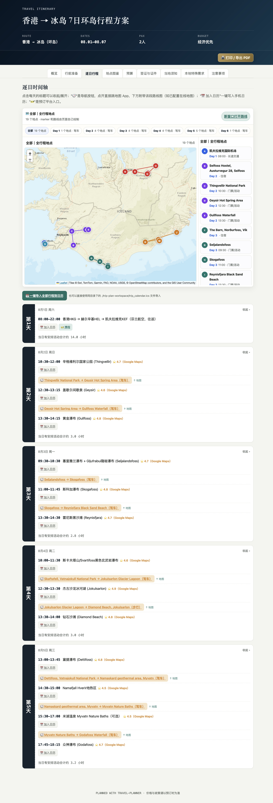
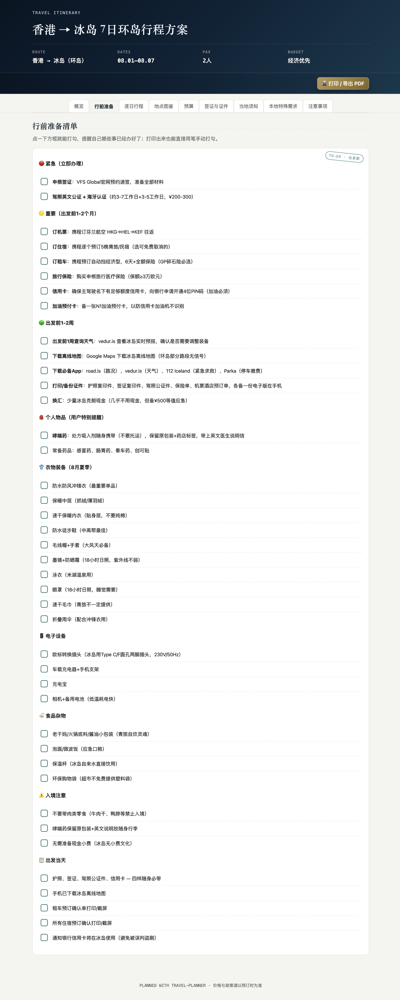
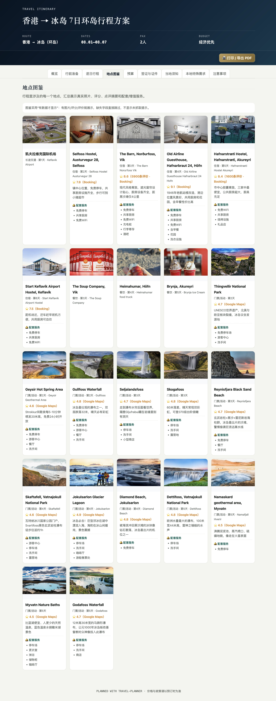
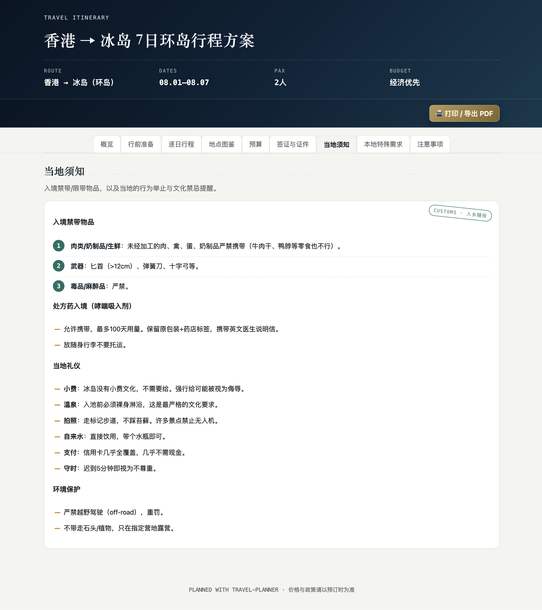
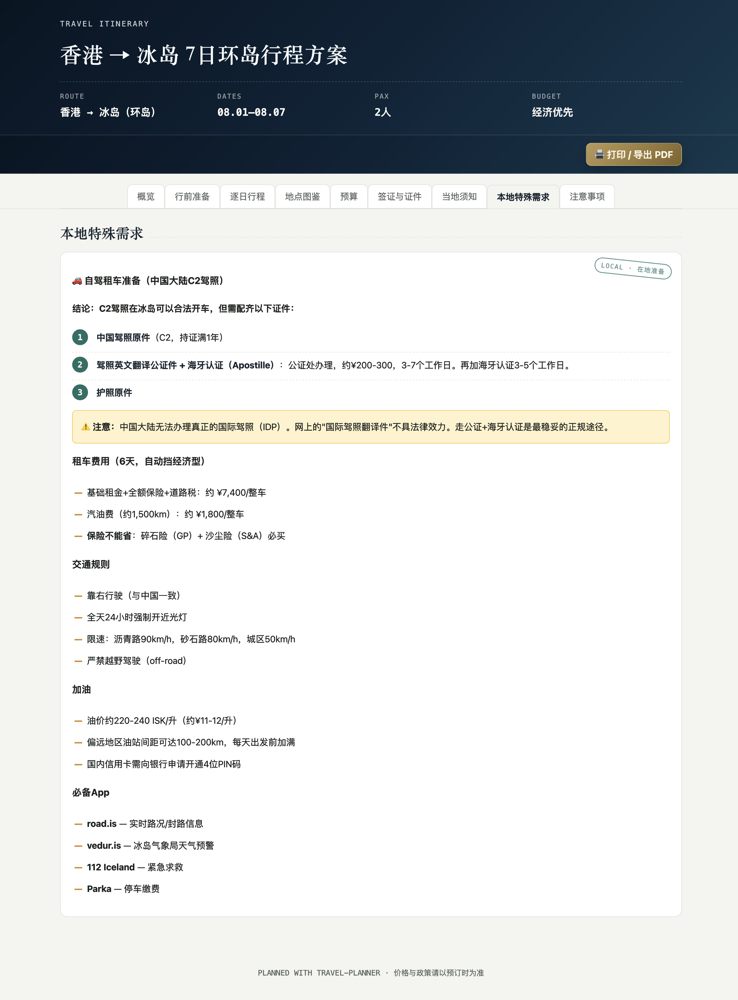

# 🛫 Voyager

<p align="center">
  <b>The friend who books flights and hotels three months before you even decide where to go—and drops a complete itinerary and budget sheet in your face while you're still scrolling.<br>Now they live inside your Claude Code.</b>
</p>

<p align="center">
  
  
  
  
</p>

> 🌐 [中文版](./README.md)

> ⚠️ **Users in mainland China are recommended to use a VPN.**

<table>
  <tr>
    <td></td>
    <td></td>
    <td></td>
  </tr>
  <tr>
    <td></td>
    <td></td>
    <td></td>
  </tr>
  <tr>
    <td></td>
    <td></td>
    <td></td>
  </tr>
</table>

---

## 💬 Preface

Everyone has that one friend, don't they?

You're still vaguely entertaining the thought of "maybe Japan this year," and they've already got the round-trip flights, hotel comparisons, daily schedule, and backup plans all sorted. While you're aimlessly scrolling through "best eats in Tokyo," they throw a minute-by-minute timeline at you: what time to leave, which train line to take, how many minutes to walk to the next spot, where to have lunch and how much per person, whether the afternoon attraction needs advance booking. By the time you finally wonder "what about the visa?", they've already checked everything: your passport validity, a complete document checklist, the week you should start applying, even the exact photo dimensions required.

You can't help but think: **if only this person could show up whenever I need them.**

Voyager is that friend.

It's not one of those chatbots that spits out a paragraph of encyclopedia trivia and disappears. It's a travel planning pipeline that **refuses to be vague, refuses to skip steps, refuses to settle for "good enough."** Give it a destination, and it will ask, search, and calculate everything—flights, hotels, dining, attractions, visas, weather, budget, pre-trip checklist—step by step. What lands in your hands isn't a chat log. It's an interactive travel guide that works on any device, ready to follow.

---

## 📌 Table of Contents

- [Preface](#-preface)
- [What It Can Do](#-what-it-can-do)
- [Design Philosophy](#-design-philosophy)
- [Complete Workflow](#-complete-workflow)
- [Directory Structure](#-directory-structure)
- [Installation](#-installation)
- [Usage](#-usage)
- [Tips & Tricks](#-tips--tricks)
- [Output](#-output)
- [Use Cases & Limitations](#-use-cases--limitations)
- [FAQ](#-faq)
- [Roadmap](#-roadmap)
- [License](#-license)

---

## 🧠 What It Can Do

Most travel tools assume you already know what you want. Voyager doesn't. It uses progressive, guided choices to help you discover your own preferences.

Most online travel guides crumble under four simple questions:

| The Test | Typical Online Guide | Voyager |
|---|---|---|
| **How much will it cost?** | "A few thousand per person, roughly" | Day-by-day, category-by-category breakdown with per-person totals, grand total, and 10-15% contingency buffer |
| **Is the schedule realistic?** | Five attractions in one day, zero transit time accounted for | Automated time conflict detection; warns if a day exceeds 12 hours or has excessive gaps |
| **Can I actually follow it?** | Walls of copied text, no way to navigate on the ground | Every location has a navigation link (Amap/Baidu/Google/Apple)—tap and go |
| **Are entry requirements sorted?** | "I think it's visa-free?" | Mandatory web search with at least two cross-verified sources; complete document checklist with timeline |

### Core Capabilities

| Area | What It Does | Deliverable |
|---|---|---|
| 🌍 Visa & Entry | Web search for visa requirements, cross-verified across at least two sources | `visa_notes.md` — full document checklist + countdown timeline |
| ✈️ Long-Distance Transport | Searches real fares; recommends best value by default while listing faster/pricier alternatives | Includes flight/train numbers, prices, booking platforms, hub amenities |
| 🚗 Local Transport | Public transit estimates / full car rental workflow (license check + traffic rules + parking + insurance) | `local_needs_notes.md` |
| 🏨 Accommodation | Searches Ctrip/Fliggy etc.; includes ratings, review summaries, amenities | 2-3 options tailored to budget tier |
| 🍜 Dining | Dual-source search (Xiaohongshu + Dianping); choose between budget ranges or specific restaurant recommendations | Per-meal cost estimates + embedded in timeline |
| 🎫 Attractions & Day Planning | Geographically clustered daily schedules, aligned with style and pace preferences; explicit transit and meal buffers | Hour-by-hour timeline + ticket/activity costs |
| 🌤️ Weather | Forecasts for trips within 2 weeks; climate norms for trips further out | `weather_notes.md` + packing/gear advice |
| ✅ Pre-Trip Checklist | Action items extracted from visa, local needs, and general prep menus, sorted by urgency | Clickable HTML checklist |
| 💰 Budget Calculation | Automated Python scripts—no mental math | Day → Category → Subtotal → Total → Per Person |
| ⏱️ Schedule Validation | Detects time overlaps, overruns, excessive gaps | Warnings + fix suggestions |
| 🗺️ Interactive Map | Leaflet + OSM; all locations pinned, switchable by day | Click markers to focus; multi-day routes |
| 📸 Place Gallery | Photos + ratings + review summaries + amenities | `places_gallery.html` |
| 📄 PDF Export | Browser-native print, zero dependencies | One-click button at the top of the page |

Two non-negotiable principles:

1. **No fabrication** — if it can't be found, it stays blank. An empty rating is more honest and useful than a made-up number. Volatile prices are clearly labeled "reference price at time of search."
2. **No skipping** — all 15 steps must be completed. Conflicts found during final review must be fixed before delivery. "Close enough" is not accepted.

---

## 🏛️ Design Philosophy

### 1. One question per message

Language, currency, budget, and dates are never crammed into a single message. More rounds are better than leaving the user unsure what to answer first.

### 2. Letter choices, not free-text typing

Every multiple-choice question uses A/B/C/D letter codes. The user replies with a single letter—especially important on mobile.

### 3. Verify online, don't rely on memory

Prices, exchange rates, visa policies, opening hours, weather—always searched. If something can't be found, Voyager says so rather than estimating a "reasonable-looking" number.

### 4. Scripts do the math, not your brain

Mental arithmetic makes mistakes. Manual transcription misses things. All costs and times are handled by Python scripts:

```
geocode_lookup.py       → Auto-fills coordinates for all locations (OSM/Nominatim)
photo_lookup.py         → Auto-searches for location photos (Google/Bing Images)
budget_calculator.py    → Day × category budget breakdown
schedule_checker.py     → Time conflict detection
itinerary_html_builder.py → Generates interactive map + timeline + calendar + gallery
```

### 5. Deliver a tool, not a document

The final product is a **self-contained HTML file** (+ optional local photo folder) that opens in any browser on any device. It's not just for reading—checklists are clickable, maps are interactive, navigation links jump straight to map apps, calendar events add to your system calendar with one click.

### 6. The last mile: consistency verification

Before delivery, the output goes through 16 cross-checks: timeline contradictions, calculation errors, visa timeline feasibility, whether driving license conclusions are specific to the user's actual license type, whether all user change requests have been applied... Anything that fails gets fixed before proceeding. "Noticed but left as-is" is not how this works.

---

## 🔄 Complete Workflow

```
 0. Initialize workspace (create directory + trip_data.json)
  ↓
 1. Gather basic info (language → currency → booking platform → origin →
    destination → dates → duration → travelers → budget → pace → style → passport → nav app)
  ↓
 2. Visa & entry document check (mandatory web search, at least two sources)
  ↓
 3. Long-distance transport (search fares, recommend + list options, user confirms)
  ↓
 4. Local transport (public transit / car rental / other)
  ↓
 5. Local special needs check (license → traffic rules → rental → parking → insurance)
  ↓
 6. Accommodation (search + ratings + recommend + confirm)
  ↓
 7. Dining (budget range or specific recommendations, including Xiaohongshu search)
  ↓
 8. Attractions & day-by-day planning (filter by preferences + schedule timeline + weather check)
  ↓
 9. Itinerary confirmation & supplements (two confirmations: schedule adjustments +
    personal items + local customs & prohibited items research)
  ↓
10. Pre-trip checklist compilation (visa action items + local needs action items +
    general prep + weather advice + personal items)
  ↓
11. Calculation & generation (5 scripts run in fixed order—no reordering, no skipping)
  ↓
12. Generate final webpage (template substitution → insert all script outputs)
  ↓
13. Final consistency check (16 cross-checks; issues found → fix → re-check)
  ↓
14. Delivery & wrap-up (open in browser preview + delivery summary + sharing guide)
```

Detailed rules for each step are in [`SKILL.md`](./voyager/SKILL.md), approximately 500 lines. Read that file if you want to modify this Skill's behavior.

---

## 📁 Directory Structure

```
voyager/
├── README.md                          ← You're reading the Chinese version
├── README_EN.md                       ← You're reading this
└── voyager/                    ← The Skill itself
    ├── SKILL.md                       ← Core rules file (complete 15-step workflow)
    │
    ├── Calculation & generation scripts (pure Python stdlib)
    ├── budget_calculator.py           ← Budget: day × category breakdown, HTML table output
    ├── schedule_checker.py            ← Timeline: conflict, overtime, gap detection
    ├── geocode_lookup.py              ← Coordinates: OSM/Nominatim auto-lookup
    ├── photo_lookup.py                ← Photos: Google/Bing Images search + download
    ├── itinerary_html_builder.py      ← Generation: interactive map + timeline + .ics + gallery
    │
    ├── Reference guides (loaded on demand, not resident in context)
    ├── visa_checklist.md              ← What to check for visas, source selection
    ├── local_needs_checklist.md       ← Car rental / special needs verification
    ├── pretrip_checklist.md           ← How to compile & sort the pre-trip checklist
    ├── weather_guidance.md            ← Forecast vs. climate reference
    ├── customs_guidance.md            ← Prohibited items + local etiquette
    ├── ratings_guidance.md            ← Where to get ratings, what to do when unavailable
    ├── services_guidance.md           ← What amenities to check, how to record them
    ├── photo_lookup.md                ← Photo search priority + copyright notes
    ├── html_content_guide.md          ← Template placeholder replacement guide
    ├── map_link_reference.md          ← Map app navigation link formats
    ├── online_map_embed.md            ← Online map implementation notes
    ├── ota_platforms.md               ← Booking platform priority + fallback URLs
    ├── calendar_notes.md              ← Calendar feature mechanics + platform behavior
    ├── sharing_guide.md               ← How to share the HTML with others
    │
    └── trip_template.html             ← Final deliverable HTML template
```

### Progressive Loading

Claude Code's Skill mechanism supports progressive loading: `SKILL.md` is loaded into context upon trigger, while the reference files it cites (`visa_checklist.md`, etc.) are only read on demand when the corresponding step is reached. This ensures each step gets detailed guidance without blowing up the context window.

---

## 📦 Installation

### Prerequisites

- [Claude Code](https://claude.ai/code) installed with a configured API key
- Python 3.x (all scripts use only the standard library—no `pip install` needed)
- Internet connection (planning requires web searches for prices, visas, weather, etc.)

### Method 1: Git Clone (Recommended)

```bash
# Clone into Claude Code's skills directory
git clone https://github.com/YOUR_USERNAME/voyager.git ~/.claude/skills/voyager

# Or use it within a specific project
git clone https://github.com/YOUR_USERNAME/voyager.git ./my-project/.claude/skills/voyager
```

### Method 2: Manual Download

1. Download the repository ZIP and extract it
2. Place the entire folder in `~/.claude/skills/` or your project's `.claude/skills/` directory
3. Make sure Claude Code can find `voyager/SKILL.md`

### Verify Installation

In Claude Code, type:

```
Help me plan a trip
```

If Claude starts the 15-step process by asking "Please choose the language for our conversation," the installation is successful.

---

## 🚀 Usage

### Auto-Trigger

You don't need to type `/travel-planner` manually—the Skill auto-triggers whenever your message sounds like trip planning. Any of these will work:

```
Help me plan a trip to Chengdu
Create a travel guide for Tokyo
How much would a trip to Iceland cost?
Do I need a visa for Thailand?
Help me look up car rental in Hokkaido
```

Even if you only provide a destination with no other details, the Skill launches and starts gathering information from Step 1.

### Manual Invocation

```
/travel-planner
```

### Typical Conversation Flow

> **You**: Help me plan a trip to Chengdu
>
> **Claude**: Please choose the language for our conversation (default: Chinese).  
> A. Chinese (default)  
> B. English  
> C. Other language, please specify
>
> **You**: B
>
> **Claude**: Which currency would you like to use for the budget?  
> A. CNY (default)  
> B. Destination's local currency  
> C. Other specified currency
>
> *……(After ~14 rounds of Q&A, all basic info collected)……*
>
> **Claude**: [Web search: visa → transport → accommodation → dining → attractions → weather; each step presents options for confirmation]
>
> *……(Calculation scripts complete)……*
>
> **Claude**: The full itinerary is ready. Before I calculate the budget and generate the final document, is there anything you'd like to add or change?  
> A. No, let's proceed  
> B. Yes, I'd like to make adjustments
>
> **You**: A
>
> **Claude**: [Generates trip_plan.html, runs 13-step consistency check]
>
> **Claude**: Would you like me to open the itinerary webpage in your browser now?  
> A. Yes, open it  
> B. No, this is fine

The entire process, from "I want to go to Chengdu" to receiving an interactive travel guide, takes approximately **15-30 rounds of conversation**, depending on the trip's complexity.

---

## 💡 Tips & Tricks

### Tip 1: Say more upfront, answer fewer questions later

The Skill collects information step by step, but if your first message already covers key details, the corresponding steps are automatically skipped:

| ❌ Less Effective | ✅ More Effective |
|---|---|
| "Help me plan a trip" | "Help me plan a 5-day trip to Tokyo, departing Dec 15, 2 people, comfort budget, want to stay near Shinjuku" |

The more you say, the more steps get skipped, and the shorter the conversation.

### Tip 2: Budget tier affects more than just "how expensive"

- **Budget**: All categories default to best-value options; accommodation leans toward hostels/budget chains; dining uses cost ranges rather than specific restaurant recommendations; long-distance transport prioritizes trains/buses over flights.
- **Comfort**: Accommodation, dining, and experiences can go up a tier—but long-distance transport **still defaults to best-value options** (pricier alternatives are listed for you to decide).
- **Custom**: Give a total budget number or category budget (e.g. "accommodation under 400/night"), and Voyager reverse-engineers all recommendations to fit.

### Tip 3: Pace preference affects more than just "how many attractions per day"

- **Packed**: Days are filled; shortest transit between attractions; minimal buffer time.
- **Relaxed**: More white space; generous buffers between attractions; won't sacrifice experience for "checklist efficiency."

This directly impacts `schedule_checker.py` thresholds—the same schedule might be "normal" under Packed mode but flagged as "too rushed" under Relaxed.

### Tip 4: Don't breeze past the two "preference" questions

Step 1 has two questions that are easy to gloss over but heavily influence attraction recommendations:

- **Travel style**: Landmark/Instagram spots vs. slow travel (hot springs, cafés, markets) vs. both
- **Scenery preference**: Nature (mountains, lakes, parks) vs. urban culture (museums, old streets, architecture) vs. both

Choosing "nature" + "relaxed" means you won't get a string of CBD shopping district Instagram spots. These two preferences directly shape the attraction pool in Step 8.

### Tip 5: Don't skip the visa step, even if you're "sure it's visa-free"

Step 2 is **mandatory**. Many people completely forget about this until after booking flights—or worse: "assumed visa-free, got turned away at the border." Voyager will:

- Cross-verify against at least two sources
- Check passport validity requirements (many countries require ≥6 months)
- Check easily-overlooked electronic entry registrations (ESTA/eTA/K-ETA type)
- Count backwards from your departure date: "recommend starting the application by week X"
- **Policies can change; re-verify closer to departure**

### Tip 6: The second confirmation in Step 9 often uncovers the most important things

Step 9 asks two things: whether to adjust the itinerary, and whether you need reminders for personal items. Many people breeze past the first (A: no changes), but the second often surfaces critical info:

> "Oh right, I'm allergic to peanuts—remind me to watch out for that"
> "Remind me to bring motion sickness medication"
> "I'm bringing a drone—can you check if it's allowed through customs?"

These items not only go into the pre-trip checklist but are also cross-checked against the "local prohibited items" research—if you mention a drone but the destination requires registration or bans them, the checklist will flag it explicitly.

### Tip 7: You don't need to worry about photos and maps

You don't need to manually hunt for images during planning. Step 11's `photo_lookup.py` and `geocode_lookup.py` automatically search using English + local language names for coordinates and photos. Famous attractions match automatically; obscure spots just need one manual addition.

**Important**: if photos are downloaded to the local `img/` folder, you must package `trip_plan.html` and `img/` together when sharing—otherwise the recipient won't see the photos.

### Tip 8: Changing your mind mid-way doesn't mean starting over

Just tell Claude "change my budget to Comfort" or "change the departure date to August 15th." It will:
1. Modify the corresponding field in `trip_data.json`
2. Re-run all Step 11 scripts
3. Re-run the Step 12-13 consistency check

No need to start from Step 1, and no manual edits to output files.

### Tip 9: The webpage is everything. PDF? Just click a button.

Voyager produces a single `trip_plan.html` (+ optional `img/` photo folder). Need a PDF? Open the page, click the "Print / Export PDF" button at the top, and select "Save as PDF" in the system print dialog. The browser is the PDF engine—no separate PDF generation needed.

### Tip 10: Domestic vs. international—automatic differentiation

The Skill automatically adapts behavior based on the destination:

| Behavior | Mainland China | International |
|---|---|---|
| Rating sources | Ctrip/Dianping/Meituan/Amap | Google Maps/Tripadvisor/Booking/Agoda/Yelp |
| Nav app recommendation | Amap or Baidu both fine | Recommend Google or Apple (Amap/Baidu data is sparse outside China) |
| Visa step | Skipped (domestic travel) | Mandatory dual-source verification |
| Currency exchange reminder | Not prompted | Prompted |
| Prohibited items | Simplified to general travel etiquette | Full search |
| SIM card / roaming reminder | Not prompted | Prompted |

---

## 📤 Output

After planning completes, you'll find the following in `./trip-plan-workspace/`:

```
trip-plan-workspace/
├── trip_data.json          ← Structured trip data used throughout the process
├── trip_plan.html          ← 🎯 The one deliverable: self-contained interactive travel guide
├── trip_calendar.ics       ← Calendar file (importable into Apple/Google/Outlook Calendar)
├── img/                    ← Location photos (must be distributed with the HTML if present)
├── visa_notes.md           ← Visa & entry document details
├── local_needs_notes.md    ← Local special needs details (car rental, etc.)
├── weather_notes.md        ← Weather lookup results
├── pretrip_checklist.md    ← Pre-trip to-do checklist
├── customs_notes.md        ← Local etiquette & prohibited items
├── budget_summary.md       ← Budget breakdown table
├── itinerary_blocks.html   ← Day-by-day timeline HTML fragment
└── places_gallery.html     ← Place gallery HTML fragment
```

### What `trip_plan.html` includes

- 🗺️ **Interactive Map**: Leaflet + OSM; all locations pinned; switchable by day; click list items to focus markers
- 🧭 **Segment Navigation**: "Open route in new window" buttons between every location, jumping to Amap/Baidu/Google/Apple Maps
- 📅 **Add to Calendar**: One-click calendar event creation for every timed item
- 📸 **Place Gallery**: Photos + ratings (with source badge) + review summaries + amenity details
- 💰 **Budget Details**: Day → Category breakdown with subtotals/total/per-person/contingency buffer
- ✅ **Clickable Checklist**: Pre-trip checklist that toggles on click and persists across refreshes
- 🖨️ **Print / Export PDF**: Top-of-page button; browser-native print; zero dependencies
- 🌤️ **Weather Card**: Trip-period weather summary with clothing/packing advice
- 📋 **Tab Navigation**: Overview / Pre-Trip Prep / Daily Itinerary / Map / Gallery / Budget / Local Info / Visa

---

## ⚠️ Use Cases & Limitations

### Best For

- Multi-day, multi-city independent travel planning
- Budget estimates that require real price and booking references
- International travel (visa, currency, driver's license, connectivity—every link needs prep)
- Road trips (license verification, traffic law differences, parking info)
- Trips where schedule feasibility is critical

### Not Ideal For

- **Day trips**: the 15-step workflow is too heavy for a same-day round trip; plain conversation is faster
- **Package tours**: transport, accommodation, and attractions are pre-arranged by the agency; no need for full calculation
- **"I'm just browsing, not actually going yet"**: Voyager assumes you're really traveling. Every search uses real booking platforms and current data. If you're just exploring, use a regular conversation instead

### Things You Should Double-Check Yourself

Voyager explicitly flags the following with "verify against official/actual sources before booking":

- Flight/hotel prices (search results lag; prices fluctuate)
- Visa policies (can change anytime; re-verify closer to departure)
- Weather forecasts (beyond two weeks: climate reference only, not a precise prediction)
- Exchange rates (real-time fluctuations; foreign currency conversions in the budget are reference values)

---

## ❓ FAQ

<details>
<summary><b>Q: How many rounds of conversation does a typical trip take?</b></summary>

It depends on the trip's complexity and how much info you provide upfront:

- **Simple domestic trip** (e.g. Chengdu, 3 days): ~15-20 rounds
- **Medium international trip** (e.g. Tokyo, 5 days): ~20-25 rounds
- **Complex multi-city international** (e.g. 3 Eastern European countries, 10 days): ~25-30 rounds

If your first message already covers origin, destination, dates, duration, travelers, and budget, you can skip at least 5-6 rounds.
</details>

<details>
<summary><b>Q: Are Python scripts really necessary?</b></summary>

Yes. Budget calculation, schedule validation, coordinate lookup, and map generation are all handled by Python scripts. Benefits:

1. No mental math errors or manual transcription mistakes
2. All scripts use **only the Python standard library**—no `pip install` needed
3. Without Python, the Skill can still complete conversational planning and recommendations, but cannot generate the interactive HTML—you'll need to compile results manually
</details>

<details>
<summary><b>Q: Is the generated trip_plan.html safe to share?</b></summary>

Yes. `trip_plan.html` is a pure frontend page—no backend logic, no data sent to any server. The map uses free OpenStreetMap data + Esri tile service, navigation links are plain URLs, and calendar buttons generate `.ics` data URIs. Safe to share with anyone. See [`sharing_guide.md`](./voyager/sharing_guide.md) for sharing tips.
</details>

<details>
<summary><b>Q: What if ratings/reviews/photos can't be found?</b></summary>

They're left blank. Missing data is recorded as `null` and the corresponding display area simply doesn't appear. Voyager's principle: **an empty field is more honest and useful than a fabricated number.**

That said, most well-known attractions and hotels match successfully via the automated scripts—over 80% hit rate.
</details>

<details>
<summary><b>Q: Can I change my mind mid-way?</b></summary>

Yes. Just tell Claude what you want to change, and it will modify `trip_data.json` and re-run the scripts. No restart from Step 1 needed. Step 9 also has a dedicated confirmation round specifically for adjustments.
</details>

<details>
<summary><b>Q: Does it support multi-destination trips?</b></summary>

Yes. Multi-city / multi-destination trips are split into sub-itineraries, each independently going through Steps 3-8 (transport → accommodation → dining → attractions), then merged into a single complete guide in Steps 10-13.
</details>

<details>
<summary><b>Q: How is this different from just asking Claude to plan a trip?</b></summary>

Without Voyager loaded, Claude can still help plan a trip—but it lacks:

- A structured 15-step pipeline (easy to miss critical but overlooked items like visas, driver's licenses, prohibited items)
- Mandatory web search verification (may give outdated information from training data)
- Automated script-based calculation (budget and scheduling done manually, prone to errors)
- 16-point cross-consistency check (contradictions in the output won't be caught)
- Standardized interactive HTML output (format varies each time)

In short: **vanilla Claude gives good travel advice; with Voyager loaded, Claude delivers a precise, follow-ready travel guide.**
</details>

<details>
<summary><b>Q: Can this be integrated into other AI tools?</b></summary>

Voyager is written for Claude Code's Skill mechanism (`SKILL.md` format). Claude.ai, the Anthropic API, and other Skill-compatible platforms can theoretically load it, but:

- Filesystem operations (directory creation, running Python scripts, opening browsers) are Claude Code-specific capabilities
- On Claude.ai web, scripts need to be run manually and interactive map features will be limited

Cursor and Codex CLI have similar "rules file" mechanisms, but the format and loading behavior differ and are not directly compatible.
</details>

<details>
<summary><b>Q: Can I use just one step without going through the full workflow?</b></summary>

If you only need a visa check or budget estimate, you can ask directly:

> "Check visa requirements for Chinese passport holders traveling to Japan"  
> "Estimate the budget for a 3-day trip to Chengdu"

Voyager will recognize you only need a specific step and skip the rest. But if you start with "plan a trip for me," it defaults to the full 15-step process.
</details>

---

## 🗺️ Roadmap

Planned features not yet implemented:

- [ ] **Token Optimization**: Significantly reduce SKILL.md size; introduce a streamlined mode to cut token usage for simple trips

---

## 📄 License

MIT

---

<p align="center">
  <sub>Made with ❤️ and an unreasonable amount of attention to detail</sub>
</p>
